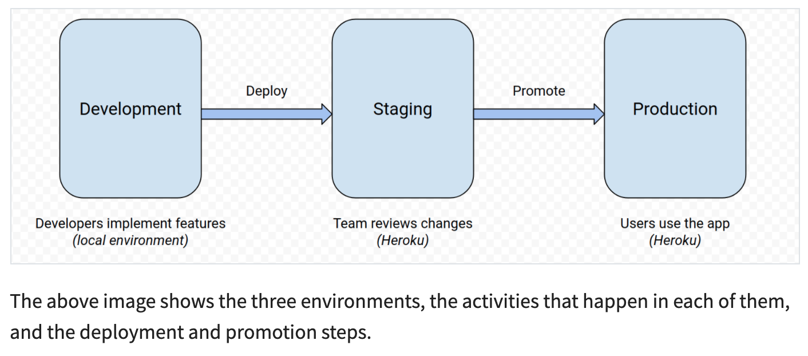

<!-- # Learning Deploying a Python Flask Example Application Using Heroku - Neural Trading Example App -->

<h1 align="center">Learning Deploying a Python Flask Example Application Using Heroku - <a href="https://neural-trading-example-app.herokuapp.com/" alt="">Neural Trading Example App</a></h1>
<p align="center">
    <a href="#" alt=""></a>
    <a href="#" alt=""></a>
    <a href="#" alt=""></a>
    <a href="#" alt=""></a>
    <a href="https://github.com/Arseni1919" alt="Follow"></a>
</p>

## About

Heroku makes building and deploying applications really friendly for developers.
It removes much of the burden related to building and running web applications,
taking care of most infrastructure details and letting you focus on creating and improving the app.
Some of the details handled by Heroku include:

- Provisioning HTTPS certificates
- Managing DNS records
- Running and maintaining servers

## Contents

- [Creating the Python Flask Example Application](https://github.com/Arseni1919/Learnig_Deploy_Flask_to_Heroku#creating-the-python-flask-example-application)
- [Deploying the Application to Heroku](https://github.com/Arseni1919/Learnig_Deploy_Flask_to_Heroku#deploying-the-application-to-heroku)
- [Redeploy The App](https://github.com/Arseni1919/Learnig_Deploy_Flask_to_Heroku#redeploy-the-app)
- [Using Heroku Pipelines to Implement a Deployment Workflow](https://github.com/Arseni1919/Learnig_Deploy_Flask_to_Heroku#using-heroku-pipelines-to-implement-a-deployment-workflow)
- [Managing Settings and Secrets for Different Environments](https://github.com/Arseni1919/Learnig_Deploy_Flask_to_Heroku#managing-settings-and-secrets-for-different-environments)
- [APScheduler](https://github.com/Arseni1919/Learnig_Deploy_Flask_to_Heroku#apscheduler)
- [Links To The Different Stages](https://github.com/Arseni1919/Learnig_Deploy_Flask_to_Heroku#links)
- [Credits](https://github.com/Arseni1919/Learnig_Deploy_Flask_to_Heroku#credits)

## Process

### [Creating the Python Flask Example Application](https://realpython.com/flask-by-example-part-1-project-setup/#creating-the-python-flask-example-application)

[(back)](https://github.com/Arseni1919/Learnig_Deploy_Flask_to_Heroku#contents)

- Initializing the Project
- Installing Dependencies
- Freeze Dependencies

```shell
$ python3 -m pip freeze > requirements.txt
```
You’ll use `requirements.txt` when deploying the project to tell Heroku
which packages must be installed to run your application code.

- Writing the Application Code
- Running the Python Flask Example Locally

### [Deploying the Application to Heroku](https://realpython.com/flask-by-example-part-1-project-setup/#deploying-the-application-to-heroku)

[(back)](https://github.com/Arseni1919/Learnig_Deploy_Flask_to_Heroku#contents)

- Heroku Account Setup
- Heroku Command-Line Interface (CLI)

The Heroku command-line interface (CLI) is a tool that allows you to create and
manage Heroku applications from the terminal.

Installation:
```shell
$ curl https://cli-assets.heroku.com/install.sh | sh
```

Login:
```shell
$ heroku login
```

- Application Deployment to Heroku

The first step is to create a file named Procfile in the project’s root directory.
This file tells Heroku how to run the app. You can create it by running the following command:
```shell
$ echo "web: gunicorn app:app" > Procfile
```

Note that this filename must start with a capital letter.
This file tells Heroku to serve your application using [Gunicorn](https://gunicorn.org/),
a Python Web Server Gateway Interface (WSGI) HTTP server compatible with various web frameworks,
including Flask. Make sure to install Gunicorn and update the requirements.txt file using pip:
```shell
$ python3 -m pip install gunicorn==20.0.4
$ python3 -m pip freeze > requirements.txt
```

Don't forget to commit all the changes to the Git.

You can create the application in Heroku by running the following command:
```shell
$ heroku create your-unique-name-app
```

Running the above command initializes the Heroku application, creating a Git remote named heroku.
Next, you can push the Git repository to this remote to trigger the building and deployment process:
```shell
$ git push heroku master
```

*Congratulations, the app is now online!*
The output shows the building process, including the installation of dependencies and the deployment.
On line 39, you’ll find the URL for your application.
In this case, it’s https://your-unique-name-app.herokuapp.com/.
You can also use the following Heroku CLI command to open your app’s URL:
```shell
$ heroku open
```


## Redeploy The App

[(back)](https://github.com/Arseni1919/Learnig_Deploy_Flask_to_Heroku#contents)

Now let’s make a small change to the app and see how you can redeploy it. Edit `app.py` and modify the string a bit.
```shell
$ git add app.py
$ git commit -m "Change the welcome message"
$ git push heroku master
```

## [Using Heroku Pipelines to Implement a Deployment Workflow](https://realpython.com/flask-by-example-part-1-project-setup/#using-heroku-pipelines-to-implement-a-deployment-workflow)

[(back)](https://github.com/Arseni1919/Learnig_Deploy_Flask_to_Heroku#contents)

This particular workflow uses three separate environments called *local*, *staging*, and *production*.
This kind of setup is widely used in professional projects since it allows testing and
reviewing new versions before deploying them to production and putting them in front of real users.

1. Development is the local environment.
1. Staging is the preproduction environment used for previews and testing.
1. Production is the live site accessed by final users.

In previous sections, you saw how to run the application on your local environment and
in the production environment on Heroku.
Adding a staging environment can greatly benefit the development process.
The main purpose of this environment is to integrate changes from all new branches and
to run the integration tests against the build, which will become the next release.

<p align="center">
    
</p>

### [Implementing the Deployment Workflow in Heroku](https://realpython.com/flask-by-example-part-1-project-setup/#implementing-the-deployment-workflow-in-heroku)

[(back)](https://github.com/Arseni1919/Learnig_Deploy_Flask_to_Heroku#contents)

Implementing the workflow in Heroku consists of two steps:

1. Creating separate applications for staging and production
1. Making both applications part of the same pipeline

A **Heroku pipeline** is a group of applications tied together by a workflow.
Each one of these applications is an environment in the development workflow, like staging or production.
Using pipelines guarantees that, after promotion, production will run the exact same code that you reviewed in staging.

In this tutorial, the previously created Heroku application your-unique-name-app is used as the production environment.
You should create a new Heroku app for the staging environment using these commands:

```shell
$ heroku create your-unique-name-app-staging --remote staging
$ git push staging master
```

Running these commands creates a new Heroku app named `your-unique-name-app-staging`
and deploys the application to it using Git.
You can then access the staging app at https://your-unique-name-app-staging.herokuapp.com/.
Note that a Git remote named `staging` is associated with this application.

Now that you have Heroku applications for production and staging,
you’re ready to create a Heroku pipeline that links them together.
You can use the Heroku CLI to create the pipeline:
```shell
$ heroku pipelines:create --app realpython-example-app \
    --stage production \
    realpython-example-app

(venv) (base) Arsenis-MacBook-Pro:Learnig_Deploy_Flask_to_Heroku arseniperchik$ heroku pipelines:create --app neural-trading-example-app --stage production neural-trading-example-app
 ›   Warning: heroku update available from 7.47.7 to 7.56.0.
Creating neural-trading-example-app pipeline... done
Adding ⬢ neural-trading-example-app to neural-trading-example-app pipeline as production... done
```

The command above creates a pipeline named realpython-example-app and
adds the app named realpython-example-app as the production environment.
Next, run the following command to create a Git remote that points to this app, naming it prod:
```shell
$ heroku git:remote --app realpython-example-app --remote prod
```
From now on, you can refer to the production deployment as prod.

Next, add the staging application to the same pipeline by running the following command:
```shell
$ heroku pipelines:add realpython-example-app \
  --app realpython-example-app-staging \
  --stage staging

(venv) (base) Arsenis-MacBook-Pro:Learnig_Deploy_Flask_to_Heroku arseniperchik$ heroku pipelines:add neural-trading-example-app --app nt-example-app-staging --stage staging
 ›   Warning: heroku update available from 7.47.7 to 7.56.0.
Adding ⬢ nt-example-app-staging to neural-trading-example-app pipeline as staging... done
```

### [Deploying and Promoting to Staging and Production](https://realpython.com/flask-by-example-part-1-project-setup/#deploying-and-promoting-to-staging-and-production)

[(back)](https://github.com/Arseni1919/Learnig_Deploy_Flask_to_Heroku#contents)

Now that you have your applications and pipeline configured,
you can use it to deploy your application to staging, review it there, and then promote it to production.

You can deploy this new version to your staging environment by running the following commands:

```shell
$ git add app.py
$ git commit -m "Another change to the welcome message"
$ git push staging master
```

When you’re happy with the changes, you can promote the new version to production using the Heroku CLI:

```bash
$ heroku pipelines:promote --remote staging
```

The above command deploys to production the exact same version that is currently running in staging.
As you’ll notice, in this case,
there’s no build step since the same build from staging is used and deployed to production.
You can verify at https://realpython-example-app.herokuapp.com/ that the application was promoted and
that it’s running the latest version.

## [Managing Settings and Secrets for Different Environments](https://realpython.com/flask-by-example-part-1-project-setup/#managing-settings-and-secrets-for-different-environments)

[(back)](https://github.com/Arseni1919/Learnig_Deploy_Flask_to_Heroku#contents)

Most applications require different settings for each environment to do things
like enabling debugging features or pointing to other databases.
Some of these settings, like **authentication credentials**, **database passwords**, and **API keys**,
are very sensitive, so you must avoid hard-coding them into the application files.

You can create a `config.py` file to hold the non-sensitive configuration values
and read the sensitive ones from environment variables.
In the following code block, you can see the source code for config.py:

```python
import os

class Config:
    DEBUG = False
    DEVELOPMENT = False
    SECRET_KEY = os.getenv("SECRET_KEY", "this-is-the-default-key")

class ProductionConfig(Config):
    pass

class StagingConfig(Config):
    DEBUG = True

class DevelopmentConfig(Config):
    DEBUG = True
    DEVELOPMENT = True
```

## [APScheduler](https://apscheduler.readthedocs.io/en/latest/userguide.html#)

[(back)](https://github.com/Arseni1919/Learnig_Deploy_Flask_to_Heroku#contents)

### Installing:

```bash
$ pip install apscheduler
```

### Configuring the scheduler:

```python
from apscheduler.schedulers.background import BackgroundScheduler
scheduler = BackgroundScheduler()
# Initialize the rest of the application here, or before the scheduler initialization
```

### Starting the scheduler:

```python
scheduler.start()
```

### Adding jobs:

There are two ways to add jobs to a scheduler:

- by calling `add_job()`

- by decorating a function with `scheduled_job()`

The first way is the most common way to do it.
The second way is mostly a convenience to declare jobs that don’t change during the application’s run time.
The `add_job()` method returns a `apscheduler.job.Job` instance that you can use to modify or remove the job later.

### Removing jobs:

When you remove a job from the scheduler, it is removed from its associated job store and will not be executed anymore.
There are two ways to make this happen:

- by calling `remove_job()` with the job’s ID and job store alias

- by calling `remove()` on the Job instance you got from `add_job()`

The latter method is probably more convenient,
but it requires that you store somewhere the `Job` instance you received when adding the job.
For jobs scheduled via the `scheduled_job()`, the first way is the only way.

```python
job = scheduler.add_job(myfunc, 'interval', minutes=2)
job.remove()

scheduler.add_job(myfunc, 'interval', minutes=2, id='my_job_id')
scheduler.remove_job('my_job_id')
```

### Pausing and resuming jobs:

```python
apscheduler.job.Job.pause()
apscheduler.schedulers.base.BaseScheduler.pause_job()

# To resume:
apscheduler.job.Job.resume()
apscheduler.schedulers.base.BaseScheduler.resume_job()
```

### Getting a list of scheduled jobs:

To get a machine processable list of the scheduled jobs, you can use the `get_jobs()` method.
It will return a list of `Job` instances.
If you’re only interested in the jobs contained in a particular job store,
then give a job store alias as the second argument.

As a convenience, you can use the `print_jobs()` method which will print out a formatted list of jobs,
their triggers and next run times.

## Links

[(back)](https://github.com/Arseni1919/Learnig_Deploy_Flask_to_Heroku#contents)

- [staging](https://nt-example-app-staging.herokuapp.com/)
- [prod](https://neural-trading-example-app.herokuapp.com/)

## Credits

[(back)](https://github.com/Arseni1919/Learnig_Deploy_Flask_to_Heroku#contents)

- [getbootstrap | Bootstrap](https://getbootstrap.com/)
- [getbootstrap | Bootstrap - Docs](https://getbootstrap.com/docs/5.0/getting-started/introduction/)
- [Real Python 1 | Deploying a Python Flask Example Application Using Heroku](https://realpython.com/flask-by-example-part-1-project-setup/)
- [Real Python 2 | Flask by Example – Setting up Postgres, SQLAlchemy, and Alembic](https://realpython.com/flask-by-example-part-2-postgres-sqlalchemy-and-alembic/)
- [Real Python | Python Web Applications: Deploy Your Script as a Flask App](https://realpython.com/python-web-applications/)
- [Real Python | Blueprints in Flask](https://realpython.com/flask-blueprint/#what-a-flask-blueprint-looks-like)
- [Heroku | Getting Started on Heroku with Python](https://devcenter.heroku.com/articles/getting-started-with-python)
- [Heroku | Pipelines](https://devcenter.heroku.com/articles/pipelines)
- [stackoverflow | Mac: Cmd+Shift+R - hard refresh](https://stackoverflow.com/questions/41144565/flask-does-not-see-change-in-js-file)
- [favicon.io | favicon-converter](https://favicon.io/favicon-converter/)
- [apscheduler | `apscheduler` package](https://apscheduler.readthedocs.io/en/latest/userguide.html)
- [apscheduler | `apscheduler.triggers.interval.IntervalTrigger`](https://apscheduler.readthedocs.io/en/latest/modules/triggers/interval.html?highlight=interval#apscheduler.triggers.interval.IntervalTrigger)
- [TDS | Create a web application with python + Flask + PostgreSQL and deploy on Heroku](https://medium.com/@dushan14/create-a-web-application-with-python-flask-postgresql-and-deploy-on-heroku-243d548335cc)
- [TDS | Focus on deploying a simple Flask Application into Heroku, interacting with PostgreSQL and Troubleshooting](https://towardsdatascience.com/deploy-a-micro-flask-application-into-heroku-with-postgresql-database-d95fd0c19408)
- [GitHub | `python-dotenv`](https://github.com/theskumar/python-dotenv)


